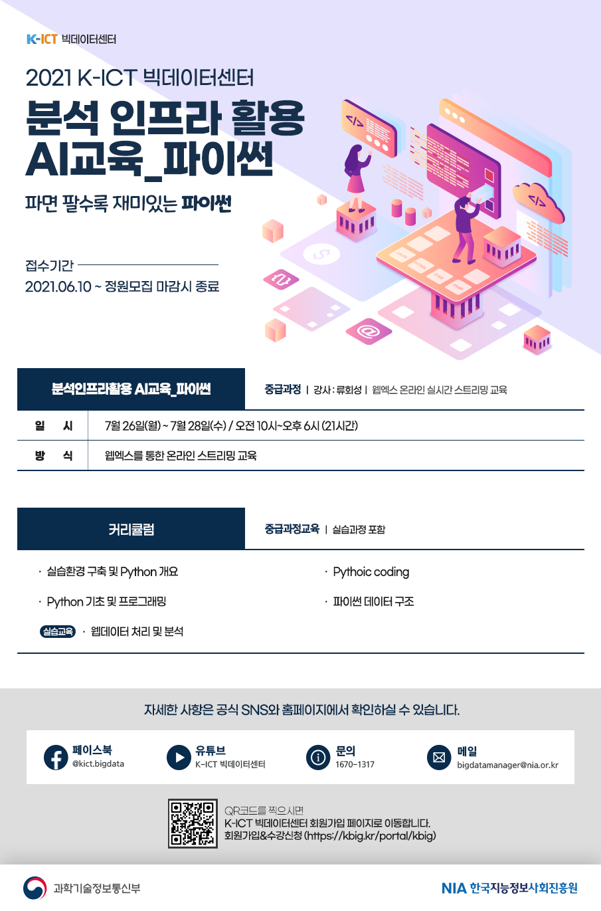

# 2021 K-ICT BigDataCenter(AI-Lecture)

## 강의 내용
본 강의는 한국지능정보사회진흥원(NIA)가 주관으로 NIA 분석인프라를 활용하여 진행되는 AI 교육입니다.

## 교육 포스터

## 강의 기간
2021.07.26 (월) ~ 2021.07.28 (수) 

## Contact
류회성: hoesungryu@korea.ac.kr

## Lisence
Copyright 2020 (C) Hoe Sung Ryu all rights reserved.
